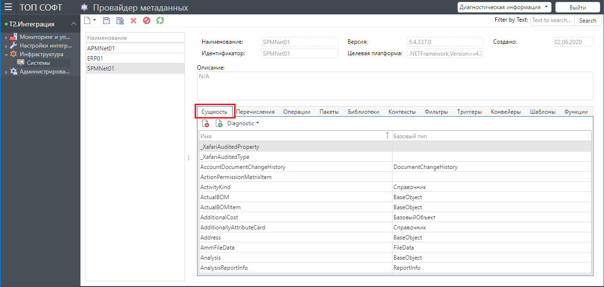
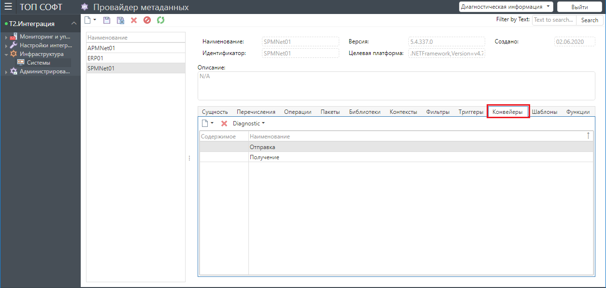

## Назначение раздела 

Данный раздел предназначен для получения информации об интегрируемых системах, зарегистрированных в Системе. Метаданные каждой из систем регистрируются и обновляются ее адаптером в автоматическом режиме при первом запуске адаптера, а также после установки обновлений системы с последующим запуском адаптера. Информация из этого раздела используется в настройках интеграции.

Раздел включает следующие подразделы:
- Системы.

### Системы

Общий вид списка интегрируемых систем:

Верхняя панель карточки системы содержит базовую информацию о системе:
- Наименование,
- Идентификатор,
- Версия,
- Платформа,
- Дата создания.

В нижней панели на отдельных вкладках выводятся группы метаданных:
- Сущности,
- Перечисления,
- Операции,
- Пакеты,
- Библиотеки,
- Контексты,
- Фильтры,
- Триггеры,
- Конвейеры,
- Шаблоны,
- Функции.

#### Сущности

Содержит наименование классов и/или таблиц в системе.

Свойства:
- Имя,
- Базовый тип.

#### Перечисления

Содержит информацию о таких типах данных системы, как перечисления.

Свойства:
- Имя,
- Пространство имен,
- Полное имя,
- Пакет,
- Версия пакета.

#### Операции

Содержит предопределенные Функции системы, доступные для вызова.

Свойства:
- Имя,
- Вид,
- Связная,
- Возвращаемый тип системы,
- Возвращаемый примитивный тип,
- Возвращает ссылку,
- Возвращает коллекцию,
- Возвращает NULL.

#### Пакеты

Содержит информацию об используемых системой библиотеках (dll файлы).

Свойства:
- Путь к библиотеке,
- Идентификатор,
- Версия.

#### Библиотеки

Содержит информацию о библиотеках, используемых адаптером системы.

Свойства:
- Имя,
- Версия системы,
- Публичный ключ.

#### Контексты

Содержит информацию о контекстах, определяемых системой.

Свойства:
- Тип,
- Наименование.

#### Фильтры

Содержит информацию о доступных шаблонах операций-фильтров, применимых к текущей системе.

Свойства:
- Контекст,
- Наименование.

#### Триггеры

Содержит информацию о доступных типах триггеров для текущей системы.

Свойства:
- Наименование,
- Идентификатор.

#### Конвейеры

Содержит информацию о доступных шаблонах конвейеров, применимых к текущей системе.

Свойства:
- Содержимое,
- Наименование.

#### Шаблоны

Содержит шаблоны для операций конвейеров.

Свойства:
- Наименование,
- Идентификатор.

#### Функции

Содержит информацию о предопределенных функциях системы.

Свойства:
- Имя,
- Глобальный ключ,
- Включено,
- Обновлено,
- Изменил,
- Возвращаемый тип,
- Исходный код.
