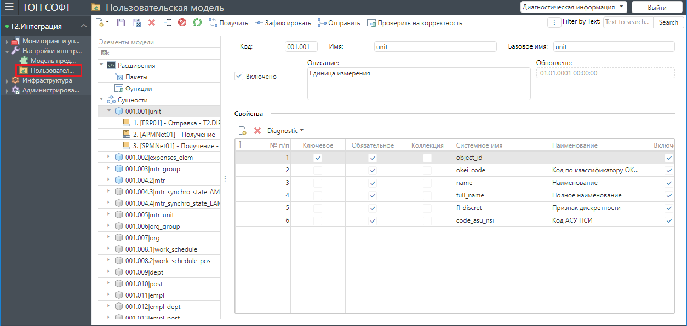

## Назначение раздела

В данном разделе выполняются все действия по настройке и активации/деактивации передачи данных между системами.

Раздел включает следующие подразделы:
- Основная модель
- Пользовательская модель

### Основная модель

Содержит актуальные настройки взаимодействия между интегрируемыми системами.

Общий вид формы для основной модели:

При работе с основной моделью доступны следующие функции:
- Получение модели из общего хранилища.
- Создание бизнес-адаптеров.
- Создание триггеров.
- Активация модели интеграции.
- Деактивация модели интеграции.

#### Получение модели из общего хранилища

#### Создание бизнес-адаптеров

#### Создание триггеров

#### Активация модели интеграции

#### Деактивация модели интеграции

### Пользовательская модель

Локальная копия **Основной модели** для каждого пользователя, который настраивает интеграцию.
Предназначена для возможности удобной и параллельной настройки взаимодействия между системами, т.к. каждый пользователь
может независимо друг от друга вносить свои изменения, не мешая остальным пользователям и не нарушая работу **Основной модели** и соответственно саму интеграцию.
При необходимости данные из **Пользовательской модели** можно перенести в **Основную модель**.

Общий вид формы для пользовательской модели:

При работе с пользовательской моделью доступны следующие функции:
- Настройка сущностей.
- Настройка конвейеров.
- Получение основной модели.
- Фиксация изменений в пользовательской модели в локальном хранилище.
- Проверка корректности пользовательской модели.
- Отправка изменений в пользовательской модели в основную модель.

#### Настройка сущностей

#### Настройка конвейеров

#### Получение основной модели

#### Фиксация изменений в пользовательской модели в локальном хранилище

#### Проверка корректности пользовательской модели

#### Отправка изменений в пользовательской модели в основную модель

