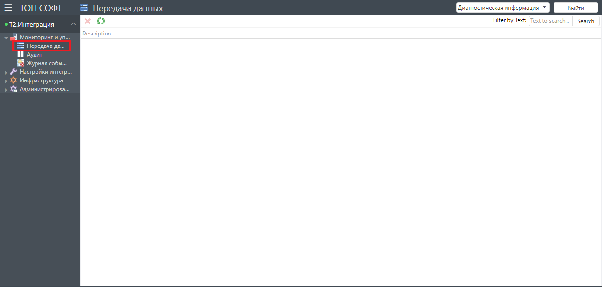

## Назначение раздела

В данном разделе выполняются все действия по мониторингу и управлению процессами передачи данных между системами.

Раздел включает следующие подразделы:
- Передача данных
- Аудит
- Журнал событий

### Передача данных

Используется для управления процессом передачи данных.

В данном подразделе могут выполняться следующие действия:
- Запуск/останов триггеров на отслеживание изменений.
- Принудительный запуск передачи данных.

### Аудит

Используется для анализа и сравнения синхронизируемых данных между различными системами.

### Журнал событий

Используется для просмотра событий, генерируемых при передаче данных между системами.

