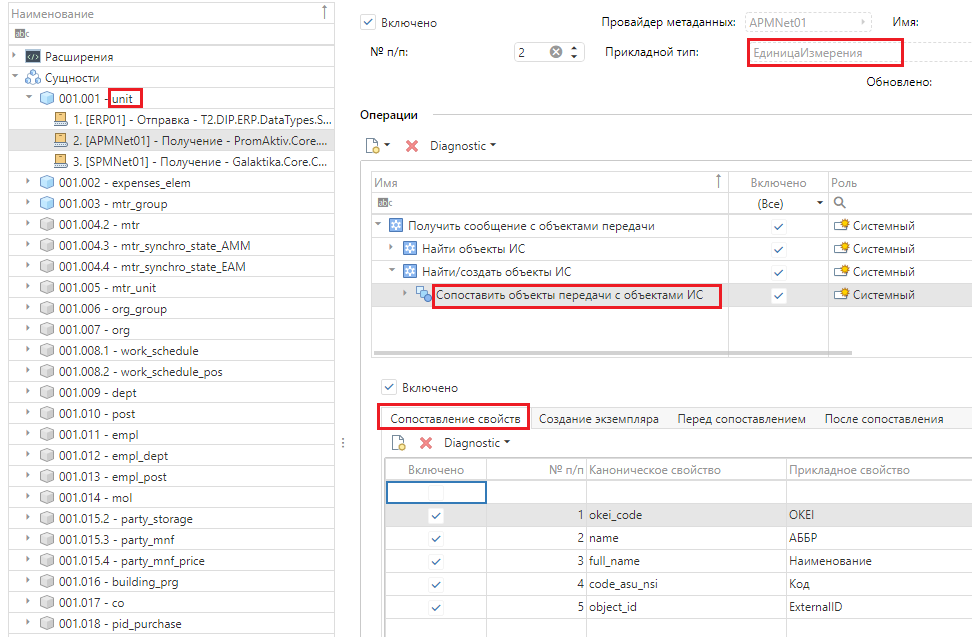
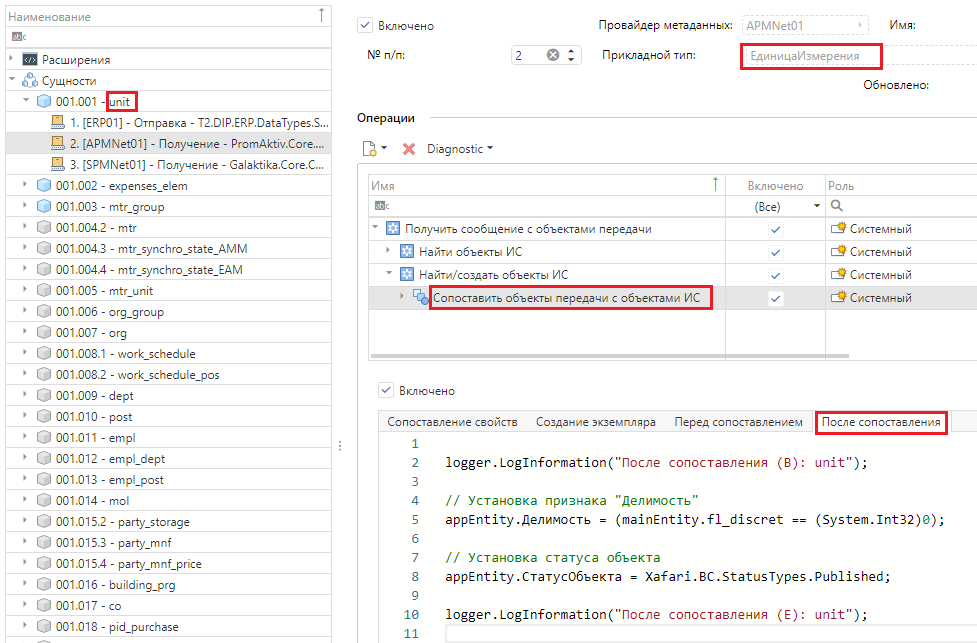

**Сопоставление** - установка соответствия между типом данных **системы** и **сущностью**.

Различают **явное** и **неявное** сопоставление.

**Явное сопоставление** представляет собой однозначное соответствие определенных свойств типа/класса данных **системы** свойствам **сущности**. 

Пример явного сопоставления данных в виде схемы:


**Неявное сопоставление** данных предполагает дополнительную, более сложную, обработку объектов при преобразовании, что требует написания программного кода по преобразованию. В **Т2 Интеграция** есть возможность использовать программный код на **C#** для дополнительной обработки преобразуемых объектов.

При отправке данных для преобразования объектов системы в объекты передачи доступны следующие виды программных скриптов:
- Генератор мастер-ключа,
- Перед сопоставлением,
- После сопоставления.

При получении данных для преобразования объектов передачи в объекты системы доступны следующие виды программных скриптов:
- Создание объекта,
- Перед сопоставлением,
- После сопоставления.

Пример программного скрипта "После сопоставления":

```
logger.LogInformation("После сопоставления (B): unit");

// Установка признака "Делимость"
appEntity.Делимость = (mainEntity.fl_discret == (System.Int32)0);

// Установка статуса объекта
appEntity.СтатусОбъекта = Xafari.BC.StatusTypes.Published;

Logger.LogInformation("После сопоставления (E): unit");
```
 
Внешний вид настройки явного сопоставления:



Внешний вид настройки программного скрипта для неявного сопоставления:



