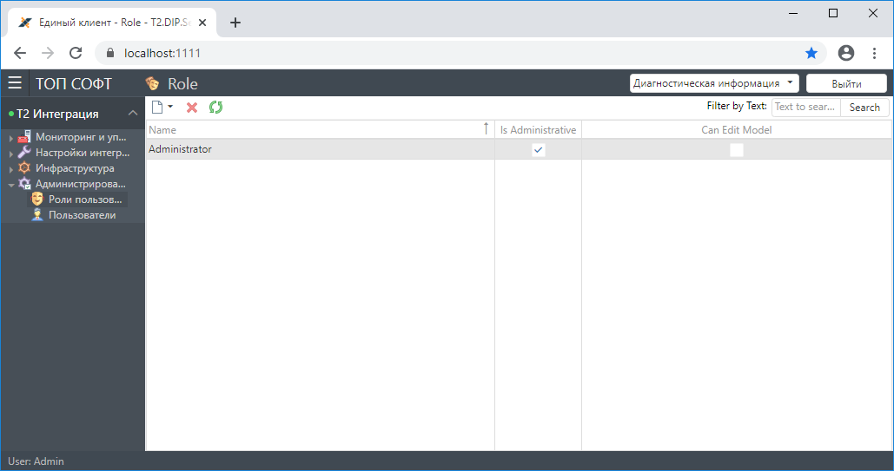
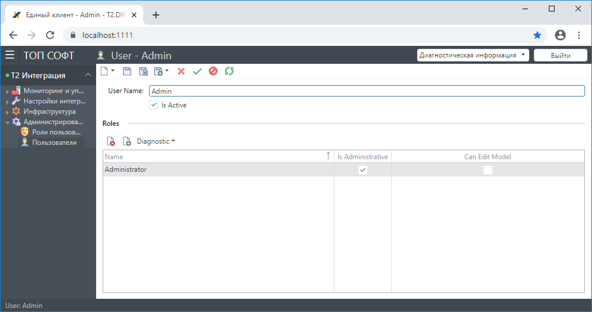

## Назначение раздела "Администрирование"

Данный раздел предназначен для управления пользователями и их правами доступа к данным и функциям Системы и содержит следующие подразделы:
- Роли пользователей,
- Пользователи.

### Роли пользователей

**Роль пользователя** - это совокупность возможностей/прав, которые получает пользователь Системы.

В этом разделе настраиваются группы с определенной комбинацией разрешений для работы с Системой, а так же назначаются пользователям эти права.

### Пользователи

В этом разделе добавляют пользователей Системы, которые могут выполнять в ней какие-либо действия в соответствии с назначенными им ролями.

