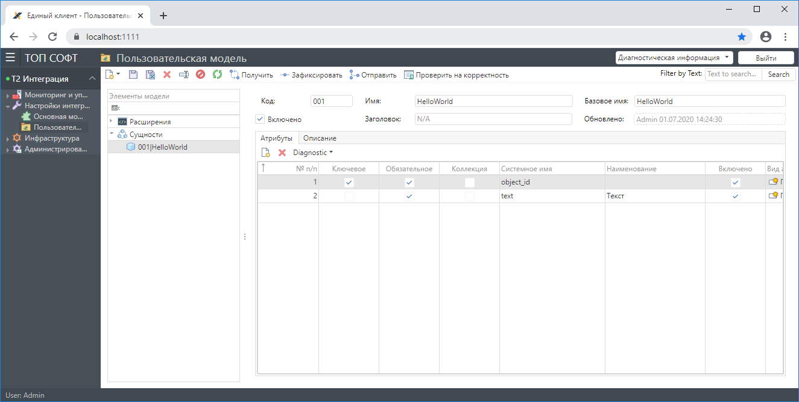
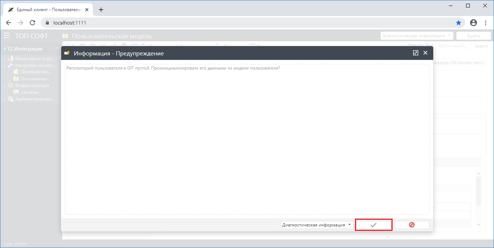
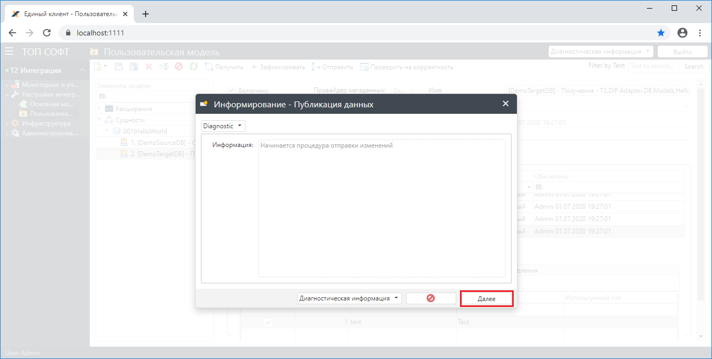
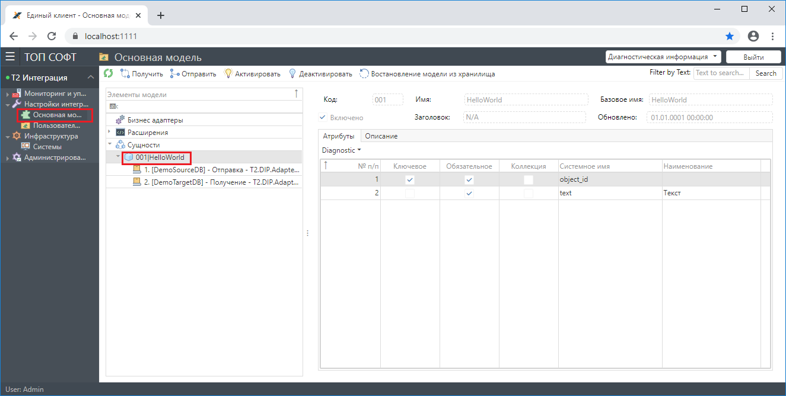
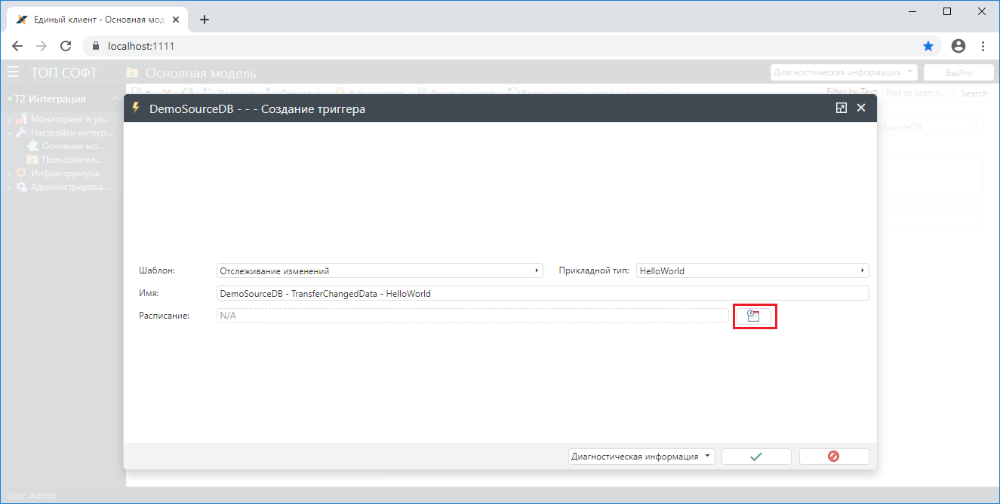

## Создание сущности

Перейдите в меню **Настройки интеграции \ Пользовательская модель** и создайте сущность **HelloWorld** в соответствии с рисунками ниже:

## Создание конвейеров

Установите курсор на сущность **HelloWorld** и создайте конвейер на отправку в соответствии с рисунками ниже:

Для операции **Сопоставить объекты ИС с объектами передачи** задайте следующее сопоставление:

Для сущности **HelloWorld** создайте конвейер на получение:

Для операции **Сопоставить объекты передачи с объектами ИС** задайте следующее сопоставление:

= Фиксация изменений в пользовательской модели =

Нажмите кнопку **Зафиксировать** для фиксации сделанных изменений в **Пользовательской модели**:

= Отправка изменений в основную модель =

Нажмите кнопку **Отправить**. Таким образом данные из **Пользовательской модели** будут перенесены в **Основную модель**.

Перейдите в меню **Настройка интеграции \ Основная модель** и убедитесь, что в ней появилась сущность **HelloWorld** из **Пользовательской модели**:

## Создание бизнес-адаптеров и триггеров

Для систем **DemoSourceDB** и **DemoTargetDB** создайте бизнес-адаптеры в соответствии с рисунками ниже: 

Для бизнес-адаптера **DemoSourceDBBA** создайте триггер на таблицу **HelloWorld** в соответствии с рисунками ниже: 

## Активация интеграции

Нажмите кнопку **Активировать** для активации **Основной модели**:

## Запуск синхронизации данных

В **SQL Server Management Studio** выполните следующую команду для имитации модификации данных в таблице **HelloWorld** в БД-источнике:

    UPDATE [T2.DemoSourceDB].[dbo].[HelloWorld] SET Text = Text;

Передача данных в БД-приемник выполнится автоматически максимум через 10 секунд.

## Результат передачи данных

Выполните команду чтения данных из таблицы **HelloWorld** в БД-приемнике:

    SELECT * FROM [T2.DemoTargetDB].[dbo].[HelloWorld];

Результатом будет строка следующего вида:

    Id   Text
    ---  ----------------------------------------------
      1  Hello World from T2.DemoSourceDB!

