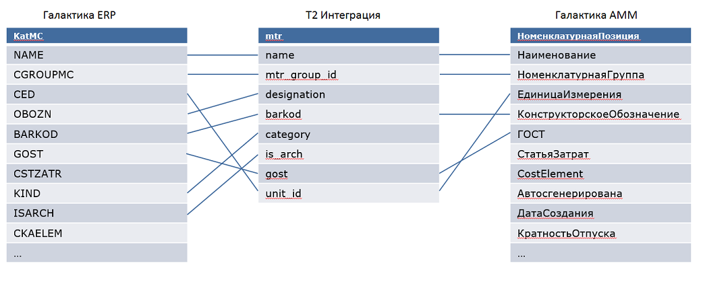

## Алгоритм передачи данных

Проще всего объяснить на примере.

Итак. Есть две системы - `А` и `Б`. Требуется передать некие данные из системы `А` в систему `Б`. После того, как данные системы будут интегрированы при помощи **T2 Интеграция**, процесс передачи данных будет выглядеть следующим образом:

1. Адаптер системы `А` извлекает из системы требуемые данные.
2. Трансформирует их в универсальный формат в соответствии с моделью интеграции. Результатом будут объекты для передачи.
3. Преобразовывает объекты для передачи в текстовое сообщение и отправляет серверу обмена сообщениями.
4. Сервер обмена сообщениями отвечает адаптеру `А` о том, что сообщение получено и помещает его в предназначенную для данного сообщения очередь `О`.
5. Адаптер системы `Б`, прослушивая очередь `О`, извлекает из нее сообщение.
6. Преобразовывает данное сообщение в объекты для передачи.
7. В соответствии с моделью интеграции трансформирует объекты для передачи в объекты системы.
8. Сохраняет результат в системе `Б`.
9. Уведомляет сервер обмена сообщениями об окончании процесса обработки сообщения.
10. Сервер сообщений удаляет обработанное сообщение из очереди.
11. На этом передача данных завершена.

## Способы инициации передачи данных

Сама по себе передача данных не происходит. Всегда требуется, что бы ее "кто-то" инициализировал. Это могут быть события в интегрируемом приложении, действия пользователя и т.д.

В **T2 Интеграция** поддерживается несколько способов инициации передачи данных:

1. ***Отслеживание изменений.*** При данном способе адаптер, используя механизмы информационной системы, следит за изменениями данных происходящими в системе и при появлении новых изменений запускает процесс передачи.
2. ***По расписанию.*** Адаптер, используя встроенный планировщик, периодически запрашивает у системы данные для передачи и, при появлении таковых, запускает процесс передачи.
3. ***Ручной режим.*** В данном случае триггером, запускающим процесс передачи данных, является пользователь **T2 Интеграция**. Он в веб-интерфейсе запускает соответствующую функцию, которая извлекает требуемые данные из системы и запускает процесс передачи.

## Модель интеграции

Вся интеграция систем в **Т2 Интеграция** описывается с помощью **модели интеграции**. Это ключевая особенность **Т2 Интеграция**.

**Модель интеграции** - это совокупность различных параметров, алгоритмов, метаданных интегрируемых систем, которая описывает все аспекты интеграции. Пользователи при помощи модели интеграции описывают структуры передаваемых сообщений, правила трансформации данных, алгоритмы обработки и фильтрации.

Основными элементами модели интеграции являются:

- системы;
- сущности;
- конвейеры.

## Этапы настройки модели

Настройка модели интеграции состоит из этапов:

1. Определяются системы, которые должны обмениваться между собой информацией.
2. Определяется содержимое передаваемой информации между системами, т.е. описываются сущности с необходимыми свойствами и примечаниями.
3. Для сущностей создаются и настраиваются конвейеры.

## Сопоставление данных

**Сопоставление данных** - это специальная операция конвейера, предназначенная для трансформации данных одного вида в другой в соответствии с заданными настройками.

