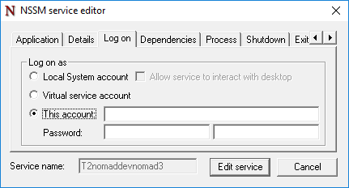
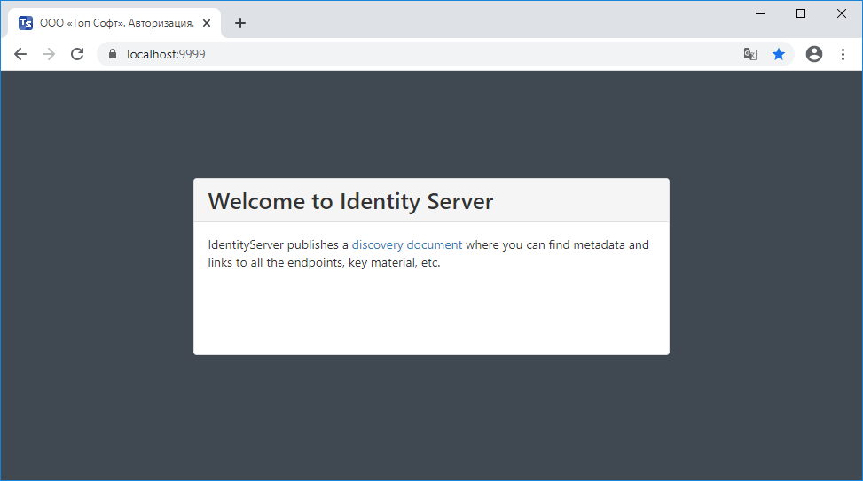
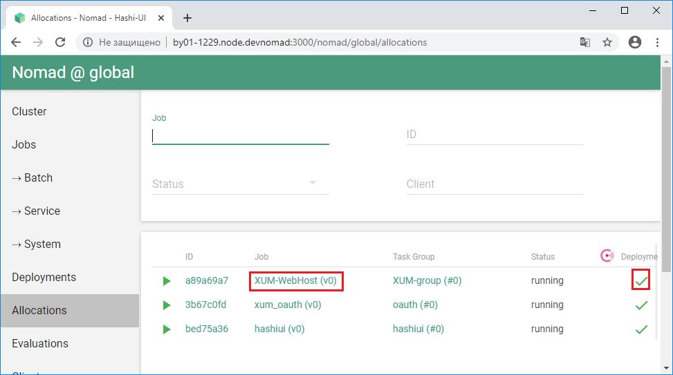
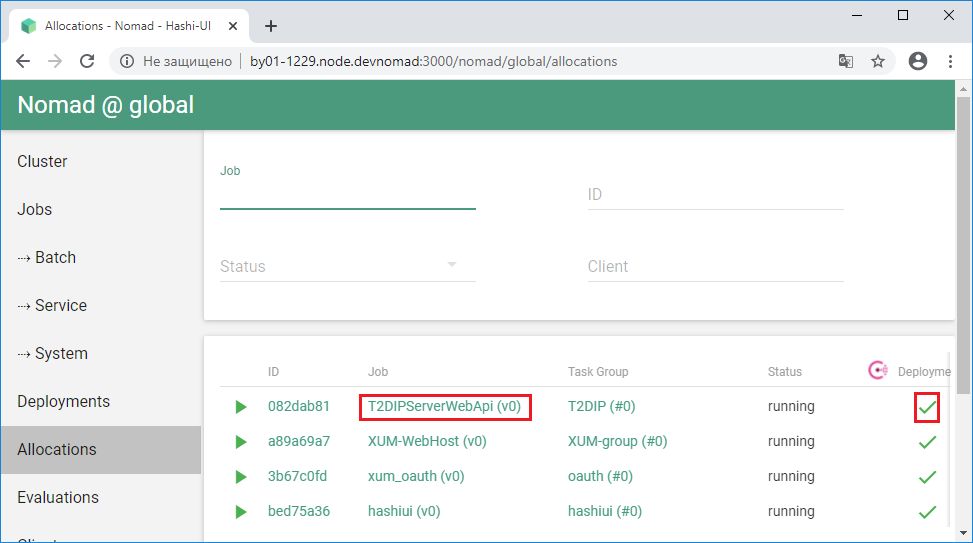

## Предварительные требования

1. [Пакет SDK для .NET Core 3.1 или более поздней версии](https://dotnet.microsoft.com/download/dotnet-core/3.1)
2. [Erlang OTP](https://www.erlang.org/)
3. [RabbitMQ Server](https://www.rabbitmq.com/)
- Версии Erlang и RabbitMQ должны быть  совместимы согласно [Таблицы совместимости версий RabbitMQ и Erlang](https://www.rabbitmq.com/which-erlang.html)
4. [Git](https://git-scm.com/)


## Установка

Для установки **Т2 Интеграция** с использованием **Nomad** скачайте пакет для развертывания [T2.Integration.Nomad](https://t2plus.ru/products/dip/) и распакуйте его у себя на локальном диске. Для простоты настройки желательно распаковать архив **Т2 Интеграция** в корень диска.

### Развертывание общего хранилища с инсталляциями программ с использованием сервиса Nginx

1. Удалить файл с расширением **pid** в папке **T2.Integration\Nginx\logs**.

2. Из Command Prompt от имени Администратора запустить файл **T2.Integration\Nginx\\!stop.cmd**, затем запустить файл **T2.Integration\Nginx\\!start.cmd** тоже от имени Администратора. В результате должен запуститься браузер со страницей [http://localhost:880](http://localhost:880) (если браузер не открылся, то необходимо запустить его вручную и указать в нем указанную страницу). На указанной странице должна быть информация вида:


>>Если при выполнении команд **!stop** и **!start** возникнет ошибка (как ниже) добавьте явно путь на **nginx.exe** в cmd-файл
>>
>>**nginx: [error] OpenEvent("Global\ngx_stop_7060") failed (2: The system cannot find the file specified)**


3. При выборе **Артефакты (%Nginx%/html/nomad)** (или же напрямую набрав в браузере [http://localhost:880/nomad/](http://localhost:880/nomad/)) должен открыться список артефактов (zip-архивов с инсталляциями программ).

4. **Внимание!** Перезапуск сервиса **Nginx** (удаление файла с расширением **pid**, запуск **!stop.cmd** и **!start.cmd**) нужно выполнять всякий раз после перезапуска компьютера. После перезапуска **Nginx** необходимо убедиться, что список zip-архивов с инсталляциями программ открывается.

### Развертывание локального кластера Nomad

1. **Внимание!** Если на компьютере отключено выполнение сценариев **PowerShell** либо имеются ограничения на их выполнение, то необходимо разрешить выполнение сценариев **PowerShell** (подробнее см. [здесь](https://winnote.ru/security/160-windows-powershell.-vypolnenie-scenariev-otklyucheno-v-etoy-sisteme.html)).
>>
>>  В качестве рекомендуемого примера:
>>  - Запустить консоль **PowerShell** от имени Администратора (в строке системного поиска набрать «PowerShell»).
>>  - Выполнить следующие команды в консоли **PowerShell**
>>  
>>         Set-ExecutionPolicy -ExecutionPolicy RemoteSigned -Scope CurrentUser
>>         
>>         Set-ExecutionPolicy -ExecutionPolicy RemoteSigned -Scope LocalMachine

2. Запустить на выполнение файл **T2.Integration\Cluster\_installcluster.cmd** от имени Администратора.

3. При развертывании кластера устанавливается децентрализованный отказоустойчивый discovery-сервис **Consul** от компании **HashiCorp**, а также средство оркестрации **Nomad** этой же компании.

4. В процессе выполнения командного файла в выдаваемом диалоговом окне перейти на вкладку **Log on**, на которой установить переключатель в положение **This account** и указать свой логин и два раза пароль:





далее нажать два раза **Enter**.

5. После развертывания кластера должен запуститься браузер со страницами
 - [http://127.0.0.1:8500/ui/dc1/services](http://127.0.0.1:8500/ui/dc1/services) (главная страница сервиса **Consul**) и
 - [http://<имя_компьютера>.node.devnomad:4646/ui/jobs](http://имя_компьютера.node.devnomad:4646/ui/jobs) (главная страница средства оркестрации **Nomad**).
<p>Если браузер не открылся, то нужно запустить его вручную и открыть указанные страницы, заменив **<имя_компьютера>** на имя своего компьютера.</p> Вид указанных страниц:


### Установка пользовательского интерфейса HashiUI для Nomad

1. Запустить на выполнение файл **T2.Integration\Cluster\_run_01_hashiui.cmd** от имени Администратора.

2. Убедиться, что сервис **HashiUI** запустился в главном окне оркестратора **Nomad** ([http://<имя_компьютера>.node.devnomad:4646/ui/jobs](http://имя_компьютера.node.devnomad:4646/ui/jobs)):


3. Сам пользовательский интерфейс **HashiUI** должен быть доступен по адресу [http://<имя_компьютера>.node.devnomad:3000/nomad/global/cluster](http://имя_компьютера.node.devnomad:3000/nomad/global/cluster):


### Установка сервера аутентификации T2.XUM.OAuth

1. Запустить на выполнение **файл T2.Integration\Cluster\_run_02_xum.oauth.cmd** от имени Администратора.

2. Убедиться с помощью **HashiUI**, что сервер аутентификации **T2.XUM.OAuth** запустился:


3. Проверить работоспособность сервера аутентификации, открыв в **Google Chrome** (это важно) ссылку [https://localhost:9999/](https://localhost:9999/). 
Должна отобразиться следующая информация:




### Установка вэб-хоста для единого клиента T2.XUM.Web.Host


1. Запустить на выполнение файл **T2.Integration\Cluster\_run_03_XUM_WebHost.cmd** от имени Администратора.

2. Дождаться, пока в **HashiUI** не отобразится информация, что **T2.XUM.Web.Host** запущен:





3. Проверить работоспособность вэб-хоста, открыв в **Google Chrome** (это важно) ссылку [https://localhost:1111/](https://localhost:1111/) . Должна отобразиться следующая информация:


4. В окне идентификации указать логин **Admin** и пароль **1**, после чего нажать **Войти**. В итоге отобразится следующее:


### Установка сервера настройки Т2 Интеграция

1. Перед установкой сервера настройки **Т2 Интеграция** необходимо настроить брокер сообщений **RabbitMQ**. В частности, необходимо создать пользователя, от имени которого сервер настройки **Т2 Интеграция** будет подключаться к **RabbitMQ**, и виртуальный хост, который будет использоваться для передачи сообщений с помощью **Т2 Интеграция**.

2. В файле **T2.Integration\Config\T2.DIP.Server.Web.Api\$CustomConfig-T2.DIP.Server.Web.Api\appsettings.json** указать актуальные значения следующих параметров:

```json title="T2.Integration\Config\T2.DIP.Server.Web.Api\$CustomConfig-T2.DIP.Server.Web.Api\appsettings.json"
{
  ...
  "AppSettings": {
    ...
    "MassTransit": {
      ...
      "HostName": "localhost", // for RabbitMQ
      "VirtualHost": "DIP",    // for RabbitMQ
      "UserName": "dip",       // for RabbitMQ
      "Password": "dip",       // for RabbitMQ
      ...
    },
    "GenerateSolutionBasePath": "C:\\T2.Integration\\RuntimeModel",
    "NuGetPackage": {
      ...
      "Repository": "C:\\T2.Integration\\LocalPackages",
      ...
    }
  },
  "ConnectionStrings": {
    "DIPConnectionString": {
      "ConnectionString": "Data Source=BY01-1229.topsoft.local\\SQL2016;Initial Catalog=T2.DIP.Server;Integrated Security=True",
      ...
    }
  },
  ...
  "Xaf": {
    ...
    "ConnectionStrings": {
      "Default": "Data Source=BY01-1229.topsoft.local\\SQL2016;Initial Catalog=T2.DIP.Server;Integrated Security=True;Connect Timeout=30;Encrypt=False;TrustServerCertificate=False;ApplicationIntent=ReadWrite;MultiSubnetFailover=False;",
      "EasyTest": "Data Source=BY01-1229.topsoft.local\\SQL2016;Initial Catalog=T2.DIP.Server;Integrated Security=True;Connect Timeout=30;Encrypt=False;TrustServerCertificate=False;ApplicationIntent=ReadWrite;MultiSubnetFailover=False;"
    }
  },
  ...
  "GitOptions": {
    ...
    "RemotePath": "C:\\T2.Integration\\GitRepos\\BUILD\\Origin\\",
    "LocalPath": "C:\\T2.Integration\\GitRepos\\BUILD\\Users\\"
  }
}
```  


**Внимание!**
При указании значения **Data Source** для параметров типа **ConnectionString** необходимо указывать явное имя инстанса, включающее в себя имя локального компьютера. Т.е. вместо **.\\SQL2016** или **(local)\\SQL2016** надо указывать, к примеру, **by01-1229.topsoft.local\\SQL2016**.

Также необходимо использовать исходное имя инстанса вместо алиаса, которое может задаваться в ''SQL Server Configuration Manager''. Т.е., например, вместо имени с указанием алиаса **by01-1229.topsoft.local\\SQL2016_ESB** использовать имя с указанием реального имени инстанса **by01-1229.topsoft.local\\SQL2016**.

Скопировать файл **T2.Integration\Config\T2.DIP.Server.Web.Api\$CustomConfig-T2.DIP.Server.Web.Api\appsettings.json** внутрь архива **T2.Integration\Config\T2.DIP.Server.Web.Api\$CustomConfig-T2.DIP.Server.Web.Api.zip**.

3. Обновленный архив **T2.Integration\Config\T2.DIP.Server.Web.Api\$CustomConfig-T2.DIP.Server.Web.Api.zip** скопировать в папку **T2.Integration\Nginx\html\nomad** (здесь находится список артефактов, доступный по ссылке [http://localhost:880/nomad/](http://localhost:880/nomad/)).

4. Запустить на выполнение файл **T2.Integration\Cluster\_run_04_T2DIPServerWebApi.cmd** от имени Администратора.

5. Дождаться, пока в **HashiUI** не отобразится информация, что **T2.DIP.Server.Web.Api** запущен:





6. Открыть лог сервера настройки **Т2 Интеграция**, перейдя в **HashiUI** по следующему пути: **Allocations =>** для **T2DIPServerWebApi** в колонке **ID** нажать на текущий идентификатор **=>** в открывшейся форме в панели инструментов нажать кнопку **Logs =>** в открывшейся форме на панели слева установить курсор на файл **T2DIPServerWebAPI.stdout.0**. После завершения запуска сервера **T2.DIP** в конце лога должна появится запись вида (время запуска сервера занимает от 2 до 5 минут):

  Application started. Press Ctrl+C to shut down.

7. Проверить, что **T2.DIP.Server.Web.Api** стал доступен на вэб-хосте общего клиента «ТОП СОФТ», нажав на странице вэб-хоста в браузере **Google Chrome** кнопку **Подключить** для **T2.DIP**. В итоге должно открыться главное окно сервера настройки **Т2 Интеграция**:


