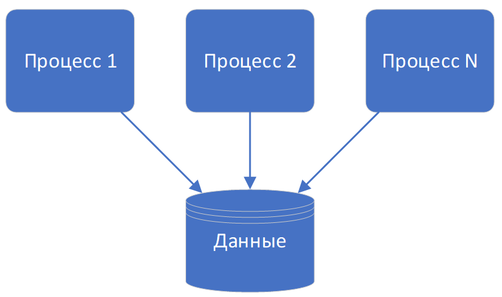
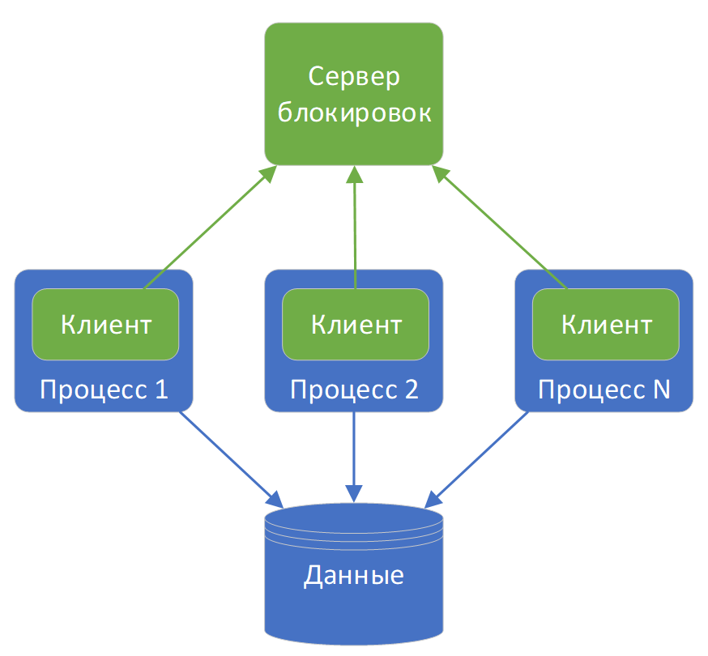

# Блокировка

В любой сложно системе рано или поздно возникают проблемы с доступом к важным ресурсам. Такими проблемными ресурсом может быть что угодно, файл на диске, запись в таблице БД, сама таблица БД, важная переменная и т.д. И проблема заключается в том, что в один момент времени данный важный ресурс может понадобится нескольким потребителям. Например, несколько приложений одновременно модифицируют файл на диске, несколько пользователей модифицируют одну и ту же запись таблицы БД или одновременно наполняют таблицу данными и удаляют их из нее. В зависимости от вида ресурса и его потребителей одновременный доступ может приводить к различным негативным последствиям, начиная от некорректных данных, заканчивая «падением» приложений или серверов.

Данная проблема успешно решается при помощи механизма блокировок. А именно – путем ограничения количества одномоментных обращений различными потребителями к ресурсу. Алгоритм достаточно простой. Потребитель, которому понадобился ресурс, проверяет, не блокирован ли ресурс другими потребителями. Если блокирован, то ожидает освобождения ресурса. Если ресурс свободен, то он блокируется потребителем на время использования. Таким образом, остальные потребители не могут получить доступ к ресурсу до его освобождения. После окончания работы с ресурсом, потребитель блокировавший ресурс, освобождает его.
В зависимости от сложности системы реализация механизма блокировок может отличаться. Например, в простых приложениях достаточно предусмотреть переменную для хранения информации о блокированных ресурсах и потребители взаимодействуя с ней смогут осуществлять обработку критичных ресурсов. В более сложных приложениях состоящих из множества компонентов или подсистем простой переменной может быть недостаточно. В данном случае для управления блокировками может быть предусмотрен отдельный компонент или сервис. В **T2 Интеграция** именно так это и реализовано. Вот упрощенная схема такой реализации:

Предусмотрен отдельный компонент – сервер блокировок. Задача которого хранить информацию о заблокированных ресурсах, блокировать\освобождать ресурсы и предоставлять информацию о блокировках по запросам клиентов. Клиент – могут по адресу обратиться к серверу блокировок, запросить информацию о блокировке того или иного ресурса, запросить блокировку\освобождение требуемого ресурса. Следует отметить, что сервер блокировок может быть как отдельным компонентом, как на схеме, так и входить в состав какого-либо из процессов. В данном случае, процесс одновременно будет являться клиентом и сервером. Взаимодействие между клиентом и сервером может осуществляться различными способами и по различным протоколам. Например, сервером может быть БД, и клиенты взаимодействуют с ним при помощи SQL. Если сервер-отдельное приложение, то клиенты могут взаимодействовать с ним через HTTP, TCP, брокеры сообщений и т.д.
