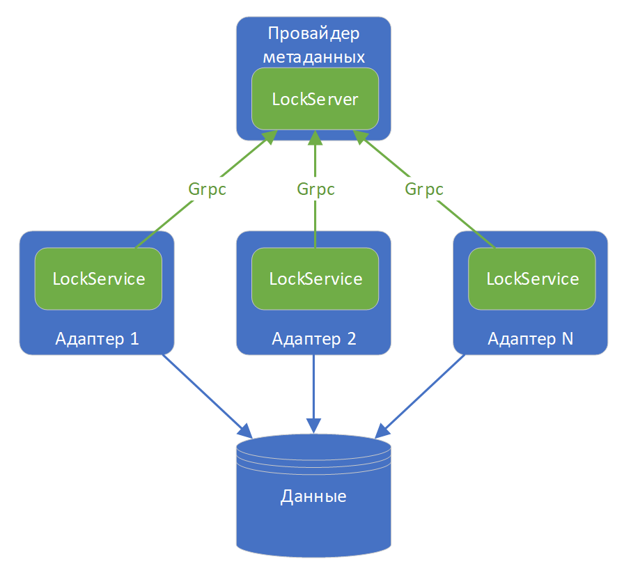

# GRPC

В Т2 Интеграция одним из протоколов взаимодействия сервера блокировок и клиентов выбран GRPC(ссылка). Это современный, кроссплатформенный, эффективный протокол, который позволяет очень просто реализовывать межпроцессное взаимодействие. Ниже схема реализации и размещения компонентов блокировок в Т2 Интеграция.

Сервер блокировок (LockService) размещается в провайдере метаданных. Клиенты (LockService) – в адаптерах. Сервисы адаптеров, которым может понадобится заблокировать какой-либо ресурс осуществляют этот через LockService. Провайдер и адаптеры, это отдельные компоненты которых могут находится на разных серверах в сети. LockServer и LockService имеют различные параметры, среди которых имя хоста сервера блокировок и номер порта.