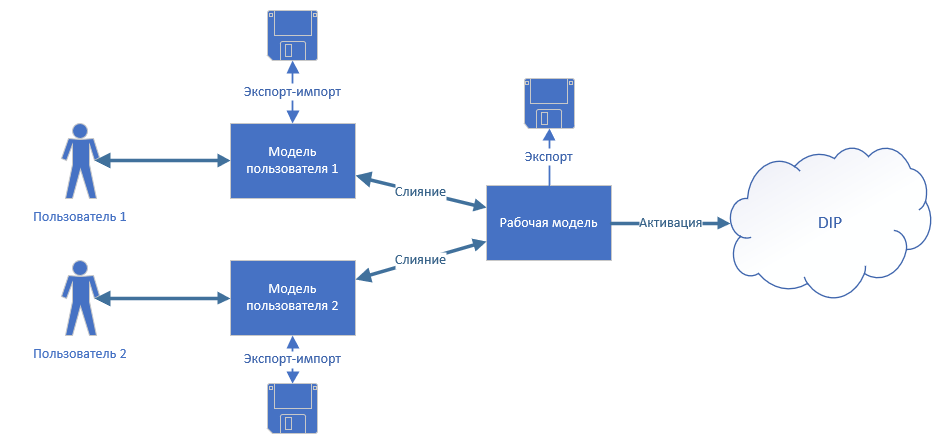

## Уровни модели интеграции

## Пользовательская модель

**Пользовательская модель** - промежуточная модель интеграции, используемая для внесения изменений в основную модель со стороны текущего пользователя **Т2 Интеграция**. Каждый пользователь производит изменения в своей модели, которые затем синхронизируются с основной моделью при помощи специальных функций.

Действие, которые можно выполнять в пользовательской модели:

- Получение основной модели из основного хранилища.
- Корректировка расширений, сущностей, конвейеров.
- Фиксация изменений в локальном хранилище пользователя.
- Отправка изменений в основную модель.
- Проверка корректности пользовательской модели.

## Основная модель

**Основная модель** - итоговая модель интеграции, которая может быть активирована. Внесение изменений непосредственно в **основную модель** запрещено. Все необходимые корректировки **основной модели** выполняются через **пользовательскую модель** с последующей отправкой **пользовательской модели** в **основную**. Вручную основная модель не корректируется.

В основной модели можно выполнять только следующие действия:

- Активация интеграции.
- Деактивация интеграции.
- Восстановление модели из хранилища.