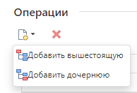
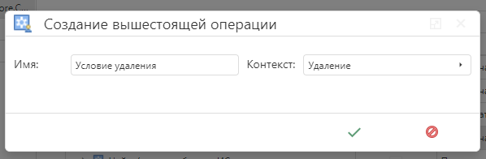
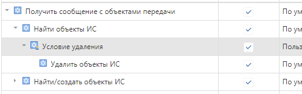

# Пример T10111. Удаление записей в целевой системе по условию.

Рассмотрим на примере. Допустим, что интегрированы две информационные системы. Источник нам не важен, но приемником, для примера, является Галактика AMM. Из системы-источника в систему-приемник передаются единицы измерения. Все конвейеры настроены, и интеграция работает успешно.

Предположим, нам необходимо изменить способ обработки сообщений об необходимости удаления единицы измерения в системе-приемнике, таким образом, чтобы не удалялись записи в наименовании которых присутствует фраза «Не удалять».

Для этого необходимо в конвейер получения перед операцией «Удалить объекты ИС» добавить новую вышестоящую операцию.




Назовем ее «Условие удаления»




Конвейер после этого должен выглядеть следующим так.




Далее в редакторе исходного кода операции «Условие удаления» необходимо вставить между тегами `//#usercode.begin` и `//#usercode.end` следующий код:

```csharp
// словарь для удаляемых объектов
var entitiesToRemove = new Dictionary<IMainEntity, TType>();

// наполняем список удаляемых объектов
foreach (var entity in context.Entities)
{
    // пропускаем единицу измерения содержащую в наименовании "Не удалять"
    if (entity.Value.Наименование.Contains("Не удалять"))
        continue;

    entitiesToRemove.Add(entity.Key, entity.Value);
}

// заменяем список со всеми объектами к удалению на отфильтрованный список
context.Entities = entitiesToRemove;
```

После этого сохранить, зафиксировать и отправить в рабочую модель внесенные изменения. После активации модели, при передаче из системы-источника в систему-приемник сообщений об удалении той или иной единицы измерения, те из них, которые будут содержать в наименовании фразу «Не удалять» будут проигнорированы и не будут удалены из системы-приемника.
